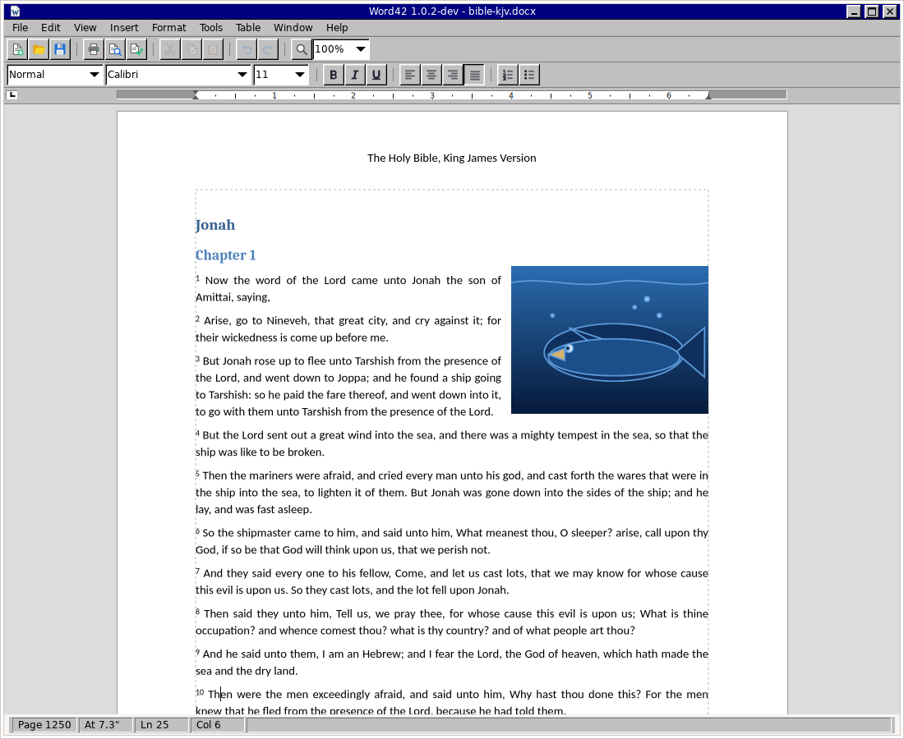

# Word42

A classic word processor, written from scratch in C on GTK 4, Pango and
Cairo: a menu bar, two toolbars, a ruler, a status bar and a page.

word42.org

[](https://github.com/office-42/word42/actions/workflows/linux.yml)
[](https://github.com/office-42/word42/actions/workflows/macos.yml)
[](https://github.com/office-42/word42/actions/workflows/windows.yml)



The [user guide](docs/GUIDE.md) describes every command in the program.

## Goals

Word42 measures itself against two yardsticks:

- the feature set of **[AbiWord](https://github.com/AbiWord/abiword/)**, a
  free word processor of long standing;
- the shape and restraint of the word processors of 1993 — Word 6 among
  them — which fitted on a handful of floppy disks and had a menu bar, two
  toolbars, a ruler, a status bar and a white galley you typed into, and were
  genuinely capable.

Word42 aims at that shape on a modern text stack that does Unicode, OpenType
and complex scripts properly. Its look is its own work: a navy title bar
drawn by the program itself, silver chrome with a four-tone bevel on every
button and the bevel inverted on every field, and a Normal view that is a
plain white galley, and a Page Layout view that opens by default: white
sheets centred on a light grey desk, each with a hairline round it, the
text smoothed and lightly hinted.

## Status

Early, but real. Word42 today is a working word processor:

- **Typing and editing** — insert, delete, Enter to split a paragraph,
  Backspace across a paragraph mark to merge, arrow keys, Home/End, Page
  Up/Down, click to place the caret, drag to select, double-click for a word,
  triple-click for a paragraph.
- **Character formatting** — font family, size, bold, italic, underline,
  strikeout, colour, superscript and subscript, held per run of text.
- **Paragraph formatting** — left, centre, right and justified alignment,
  left/right/first-line indents, space before and after, line spacing.
- **Styles and numbered headings** — Normal, Heading 1–3 and Title in the
  Style box, Format ▸ Style to redefine them (and every paragraph in the
  style follows), Ctrl+Alt+1/2/3 for the headings. Format ▸ Heading
  Numbering numbers the sections — 1, 1.1, 1.2, 2 — from the outline levels,
  the way the classic ones did. The stylesheet round-trips through RTF, and Word's
  own `heading 1` lands on Word42's Heading 1.
- **Headers, footers and page breaks** — View ▸ Header and Footer sets a
  line of text at the top and bottom of every page, with `{PAGE}`,
  `{NUMPAGES}` and `{DATE}` fields; Insert ▸ Page Numbers is the shortcut for
  the common case. Ctrl+Enter starts a new page. All of it round-trips
  through RTF as `\header`, `ooter`, `\chpgn`, field groups and `\pagebb`,
  and a field in the body of a Word file shows its cached result rather than
  its code.
- **OpenDocument .odt** — File ▸ Open and Save As read and write
  the OpenDocument format: styles resolved through their parents,
  paragraphs and spans, lists with their levels, tables with merged
  cells and borders, pictures, footnotes and endnotes, links,
  bookmarks, annotations, fields, the page and its columns, header and
  footer with fields.
- **Word .docx and AbiWord .abw** — File ▸ Open and Save As read and
  write Word's own format since 2007 and AbiWord's: paragraphs and
  their styles, alignment, indents and spacing, runs with font, size,
  bold, italic, underline, strikeout, colour, highlight, caps and
  position, lists of every kind, tables with merged cells, pictures,
  footnotes and endnotes, hyperlinks, bookmarks, revision marks,
  sections with their columns, headers and footers with page-number
  fields. The zip inside a .docx is read and written with GLib's own
  deflate, so no new library is needed; .zabw is the gzipped .abw.
- **Word .doc import** — File ▸ Open reads Word 97–2003 documents: text,
  paragraph and character formatting, headings by their built-in identity
  (so a Norwegian "Overskrift 1" is a Heading 1), tables, PNG and JPEG
  pictures at the size Word showed them, page setup, header and footer with
  their page-number fields, footnotes. A Word 6 or 95 file
  yields its text and paragraphs. Saving goes to RTF or .docx, which Word opens.
  Lists are read from the list tables, so numbered lists come in
  numbered and bulleted ones bulleted.
- **Table of Contents** — Insert ▸ Table of Contents puts one paragraph per
  heading at the caret, indented by level, with the page number at a right
  tab stop at the margin — plain paragraphs, as the classic field result was,
  to edit or delete freely.
- **Columns** — Format ▸ Columns: one, two or three newspaper columns with
  a spacing between them. The text flows down one column and on to the
  next in Page Layout view, footnotes at the foot of their column, and the
  last page's columns balanced so they end level; Normal view shows one
  column, as the classic word processors did. RTF carries them as `\cols` and
  `\colsx`, and a `.doc`'s section columns are read.
- **Web pages** — File ▸ Export as Web Page writes one self-contained
  HTML file: headings, paragraphs with their alignment and indents, runs
  with font, size, weight, colour and links, lists, tables, pictures
  embedded, footnotes as links to the notes at the end. File ▸ Open reads
  HTML back — a plain reading, with no CSS engine, that brings in what
  Word42 wrote and most pages that are text: headings, paragraphs, bold,
  italic, links, lists, tables, embedded pictures.
- **Autosave and recovery** — every two minutes a modified document is
  written to a copy in your data directory; a clean close or a save removes
  it, and if Word42 stops without either, the next start opens the copy as
  the document it was, marked modified, and says so.
- **Font effects and recent files** — Format ▸ Font Effects: strikethrough, overline,
  superscript, subscript, small caps, all caps, a highlight colour and
  character spacing, all through RTF (`\scaps`, `\caps`, `\highlight`,
  `\expndtw`) and from `.doc`. The File
  menu keeps the last eight files opened or saved.
- **Fields** — Insert ▸ Field puts a page number, number of pages,
  date, time, file name or word count into the text as a field: its
  result, shaded grey as Word showed it, renewed by Update Fields (F9)
  and before printing or exporting. Fields go through RTF as
  `\field` groups, .docx as `fldSimple`, .abw as `<field>`.
- **Formatting marks** — View ▸ Show Formatting Marks (Ctrl+Shift+8)
  paints a dot for every space, an arrow for a tab, a bent arrow for
  a line break and a pilcrow at every paragraph end, in blue, as
  Word's ¶ button did. Insert ▸ Column Break starts the next column.
- **List kinds** — Format ▸ Bullets and Numbering: 1. 2. 3., a. b. c.,
  A. B. C., i. ii. iii., I. II. III., and round, open, square and dash
  bullets, with numbering restarted at any item. RTF carries them as
  Word's `\pn` formats, HTML as `<ol type>`/`start`, and a `.doc`'s
  level formats map on to them.
- **Drawing** — Insert ▸ Drawing puts a line, arrow, rectangle, rounded
  rectangle or ellipse in the text, with its line width, colour and fill
  chosen in the box. The classic word processors drew these on a Drawing toolbar; Word42
  draws them as pictures, so they resize with the handles and go
  through RTF, HTML and PDF like any picture.
- **Hyphenation** — Tools ▸ Hyphenation ▸ Hyphenate Document puts soft
  hyphens into every word by the language's patterns (libhyphen and
  the hyph_*.dic hyphenation dictionaries; English comes with the Windows
  bundle), so lines break inside words where they may; Remove
  Hyphenation takes them out. Soft hyphens go through RTF as `\-` and
  HTML as `&shy;`, and the spelling checker looks past them.
- **Right-to-left paragraphs** — Format ▸ Paragraph ▸ Direction. Arabic
  and Hebrew text already shapes and runs right-to-left on its own; the
  setting makes the paragraph's base direction and alignment
  right-to-left as well, as Word's `\rtlpar` does.
- **Sections** — Insert ▸ Section Break starts a new section on a new
  page, and Format ▸ Columns can apply to the whole document, this
  section, or this point forward, so a two-column article can follow
  a one-column title. Section breaks go through RTF as `\sect`.
- **Cross-references** — Insert ▸ Cross-reference puts in the page number
  a bookmark is on, or the bookmarked text itself.
- **Table of contents that updates** — the table Insert ▸ Table of
  Contents makes carries a bookmark, and Insert ▸ Update Table of
  Contents rebuilds it in place from the headings and page numbers as
  they now are.
- **Change Case** — Format ▸ Change Case: Sentence case, lowercase,
  UPPERCASE, Title Case, tOGGLE cASE (Shift+F3), each character keeping
  its own formatting.
- **Revision marks** — Tools ▸ Revisions ▸ Mark Revisions While Editing
  (Ctrl+Shift+E): from then on typed text is underlined in red and
  deleted text is struck through in red rather than removed. Accept All
  keeps the insertions and drops the deletions; Reject All does the
  opposite. The marks survive in RTF (`\revised`, `\deleted`) and
  export to HTML as `<ins>` and `<del>`.
- **Mail merge** — Tools ▸ Mail Merge: Get Data opens a CSV file whose
  first row names the fields; Insert Merge Field puts «Name» into the
  text; Merge to New Document writes one copy of the letter per record,
  each on its own page, and opens it in a new window.
- **Captions** — Insert ▸ Caption starts a "Figure N:" paragraph in the
  Caption style, N counting on from the captions already there.
- **Annotations** — Insert ▸ Annotation (Ctrl+Alt+A), the classic comments:
  an annotation on the selected text, shown as a pale wash, listed in a
  modeless box that selects each one on a click and deletes them; through
  RTF as Word's `\atrfstart`/`\annotation` groups, and as tooltips in the
  web page export.
- **Hyperlinks and bookmarks** — Insert ▸ Hyperlink (Ctrl+K) makes the
  selection a link, or types the address in as one; links are blue and
  underlined, the pointer says so over them, and Ctrl+click follows one.
  Insert ▸ Bookmark names the selection; Go To finds bookmarks by name.
  Both travel through RTF as HYPERLINK fields and `\bkmkstart`/`\bkmkend`,
  and a `.doc`'s HYPERLINK fields keep their addresses.
- **Endnotes** — Insert ▸ Endnote (Ctrl+Alt+E): the same as a footnote,
  numbered i, ii, iii, with the notes after the text under a rule, breaking
  pages as text does. RTF marks them `\ftnalt`.
- **Footnotes** — Insert ▸ Footnote (Ctrl+Alt+F) puts a numbered mark at
  the caret and takes you to the note at the foot of the page; notes are
  numbered in order, move with their lines from page to page, and sit after
  the text in Normal view. Ctrl+Alt+N jumps between a mark and its note.
  Deleting a mark deletes its note, and undo brings both back. RTF carries
  them as `{\footnote ...}` with `\chftn`.
- **Borders and shading** — Format ▸ Borders and Shading puts a line
  above, below, beside or round a paragraph in three weights, and a grey
  shading behind it; drawn by every painter, so it prints and exports as it
  shows. RTF carries them as `\brdrt`…`\brdrw` and `\shading`.
- **Tabs and a live ruler** — left, centre, right and decimal tab stops,
  every half inch by default; Format ▸ Tabs to set them by number, or click
  the ruler to set one where you click, drag it to move it, drag it off to
  lose it, with the box at the ruler's left cycling the kind as the classic ruler's
  did. The ruler's indent markers are real too: drag the first-line, left
  and right indents. RTF carries stops as `\tx`, `\tqc`, `\tqr`, `\tqdec`.
- **Options** — Tools ▸ Options: measurement units (inches or
  centimetres, for every dialog and the ruler), the view and zoom a new
  window opens with, spelling as you type. The View menu's toolbar and ruler
  toggles are remembered too. Kept in a small settings file in your
  configuration directory.
- **New Window, Help** — Window ▸ New Window opens a second window on the
  same document, edits showing in both, as the classics did; Help ▸ Contents (F1)
  is a page of what Word42 does and the keys that do it.
- **Go To, Date and Time, Symbol** — Edit ▸ Go To (Ctrl+G or F5) by page
  or line; Insert ▸ Date and Time offers today in a dozen formats; Insert ▸
  Symbol is a grid of the characters a keyboard has not got, modeless so
  you can pick, type, and pick again.
- **Spelling** — red underlines under words the dictionary does not know,
  as you type (Tools ▸ Automatic Spell Checking to turn them off), and
  Tools ▸ Spelling, the classic box: Not in Dictionary, Change To,
  Suggestions, Ignore / Ignore All / Change / Change All / Add. Built on
  Enchant, so it uses whatever Hunspell, Aspell or system dictionary is
  installed for your language; without one, the box says so.
- **Bullets and numbering** — the two buttons on the formatting bar, or
  Format ▸ Bullets / Numbering (Ctrl+Shift+L for bullets). An item gets a
  quarter-inch hanging indent with the marker in it; numbers count along a
  run of numbered paragraphs and start over after anything else; Enter on
  an empty item ends the list. RTF carries them as `\pn` groups.
- **Table columns and properties** — Table ▸ Insert Columns and Delete
  Columns (a merged cell across the place grows or shrinks), and Table
  ▸ Table Properties: the rules around the cells on or off, and shading
  for the caret's cell. Both go through RTF (`\clbrdr…`) and .docx
  (`w:tblBorders`).
- **Tables** — Table ▸ Insert Table for a grid of any size after the current
  paragraph; Tab and Shift+Tab move between cells, Tab past the last cell
  adds a row, Enter makes another paragraph inside a cell; Insert Rows and
  Delete Rows on the Table menu; drag a cell's right edge to change the
  column widths; select across cells of a row and Merge Cells joins them,
  keeping every cell's paragraphs. Rows are as tall as their tallest cell and
  move to the next page whole. The marks that hold a table together cannot
  be deleted by accident, only the text in the cells. RTF carries tables as
  `\trowd`…`\cell`…`\row`, both ways, column widths and merged cells
  included.
- **Print Preview** — Word42's own window, not an external viewer: pages on
  a grey ground, zoom, a page counter, and a Print button. What it shows is
  what prints, because it is the same layout engine.
- **Undo and redo** — unlimited, with a run of typing collapsing into one step
  and compound edits grouping into one, exactly as you would expect.
- **Two views** — Normal, a continuous galley, and Page Layout, with real
  pagination onto US Letter sheets, margins and text boundaries. Both share
  one layout engine and one ruler; zoom runs from 25% to 500%.
- **Files** — RTF, Word .docx, AbiWord .abw, HTML and plain text, read
  and written; Word .doc and PDF read. The RTF reader handles
  what Word and WordPad actually emit: font and colour tables, character runs,
  alignment, indents including hanging ones, space before and after, line
  spacing multiples, code-page bytes, Unicode escapes with surrogate pairs,
  and destinations it does not understand are dropped whole rather than
  guessed at. Plain text handles CRLF, CR and Windows-1252 input.
- **Picture handles** — click a picture to select it and eight handles
  appear; drag a corner to resize it keeping its shape, a side to stretch
  it. A dotted outline shows the size it will be until you let go, as in
  the classics, and the resize undoes like any edit.
- **Pictures** — Insert ▸ Picture puts a picture into the text flow, where
  it occupies one position exactly as a character does: it wraps, it sits on
  the baseline, Delete and Undo treat it as one thing. Every format gdk-pixbuf
  has a loader for: PNG, JPEG, GIF, BMP, TIFF, WebP, AVIF, HEIF, SVG. The
  bytes as loaded are what the document keeps, so a JPEG saved is the same
  JPEG; RTF carries pictures as `\pict`, PNG and JPEG as they are and the
  rest re-encoded as PNG.
- **Text frames and drop caps** — Format ▸ Frame sets a paragraph in a
  frame at the left or right of the column, the text after it running down
  the other side; framed paragraphs one after another share the frame.
  Format ▸ Drop Cap drops a paragraph's first letter over three lines (or as
  many as you like). Beside a picture, a frame or a dropped letter the text
  is set line by line, and the rest of the paragraph at full width. Word,
  OpenDocument and HTML files carry both.
- **Underline styles** — single, double, words only, dotted, dashed, thick
  and wave, in Format ▸ Font Effects; RTF, Word and OpenDocument files
  carry every one of them, both ways.

- **AutoCorrect** — Word 6's four corrections, made as you type: straight
  quotes become the curly ones that fit where they stand, TWo INitial
  CApitals become one, the first word of a sentence takes its capital, two
  hyphens become a dash, and a short list of misspellings — teh, adn,
  recieve — is put right. Tools ▸ AutoCorrect shows the list, and the
  switch is there and in Tools ▸ Options. The correction and the character
  that prompted it undo together.

- **Slides** — View ▸ Slide Show puts the document's outline on the screen
  as a talk: each heading and the lines under it are a slide, in type large
  enough for a room, the space bar or the arrow keys moving on and Escape
  ending it. File ▸ Export as Presentation writes the same outline as a
  `.pptx`, which PowerPoint and Impress open; File ▸ Open reads one back,
  each slide's title becoming a heading and its lines the paragraphs under
  it. A word processor is not a presentation program, and Word42 does not
  pretend to be one — but a document is a talk waiting to be given.

- **Splash screen** — the logo, centred over the first window for six tenths
  of a second while it opens.
- **Styles of your own** — Format ▸ Style has New and Delete: a new style
  follows the one it was based on, keeping only what you change in it, so
  changing the base changes everything built on it;
  a character style carries font, size, weight, slant, underline, colour
  and case, and goes on the selected text the way Bold does. Word,
  OpenDocument and AbiWord files carry them, and styles those files define
  are read in.
- **Summary Info** — File ▸ Summary Info takes a title, subject, author,
  keywords and comments, and Word, OpenDocument and RTF files carry them
  (docProps/core.xml, meta.xml, the `\info` group); what those files say is
  read back.
- **The Window menu** lists the open documents and numbers them, and
  Arrange All puts them side by side.
- **Edit ▸ Paste Special** puts the clipboard in as plain text; **Clear**
  takes the selection out without touching the clipboard; **File ▸ Save All**
  saves every document with changes; **Insert ▸ File** brings another
  document's paragraphs in at the caret; **View ▸ Full Screen** gives the
  page the whole screen.
- **The Table menu** — Select Row and Select Table; Sort Ascending and
  Descending by the first column, header rows staying put and each row's
  formatting travelling with it; Split Table, which makes the caret's row
  the start of a table of its own; Convert, which turns a table into
  paragraphs with tabs between the cells and turns tabbed paragraphs back
  into a table; and Table Gridlines, which shows the cells of an unruled
  table faintly on screen without printing them.
- **Cell borders** — Table Properties rules any of a cell's four sides on its
  own, over the table's setting; Word, RTF and OpenDocument carry them.
  Every table property is an undo step.
- **Find and Replace** picks up the selected word, and Change Case with
  nothing selected changes the word at the caret, as Word does.
- **User Info** — Tools ▸ Options takes your name; annotations and revisions
  carry it in Word and OpenDocument files.
- **Table rows** — Table ▸ Split Cells undoes a merge; Table Properties
  gives a row a least height and repeats the first row at the top of every
  page a long table runs on to. Word, RTF and OpenDocument files carry
  both.
- **Wrapped pictures** — Format ▸ Picture sets a picture's size and puts it
  at the left or right of its paragraph, level with the first line, with
  the text running down the other side; the paragraphs that follow stay
  beside it until they pass its foot, a paragraph at a time as the classic
  frames did. Word, OpenDocument, AbiWord and HTML files carry the wrap.
- **PDF** — File ▸ Export as PDF writes the document through the same layout
  engine and painting code the screen and printer use. Opening a `.pdf`
  imports it: the text with paragraphs recovered from the line breaks, the
  pictures, and the page size. A PDF is a picture of a document rather than
  the document, so that is what there is to recover.
- **Printing** — File ▸ Print through the system's print dialog on Windows,
  CUPS on Linux and GTK's own dialog on macOS; where no print backend works,
  Word42 offers to write the same pages to a PDF instead.
- **Page Setup** — paper size, orientation and the four margins.
- **Paragraph** — alignment, left and right indents, first-line and hanging
  indents, space before and after, single/1.5/double line spacing, and text
  flow: widow and orphan control (on by default, as Word had it), keep
  lines together, keep with next. Through RTF as `\widctlpar`, `\keep`,
  `\keepn`, and from `.doc`.
- **Clipboard** — cut, copy and paste carry RTF as well as text, so
  formatting, pictures and paragraphs survive a round trip through the
  clipboard and formatted text from other programs comes in formatted;
  plain text pasted has its line breaks becoming real
  paragraphs.
- **Keyboard and mouse** — Ctrl+Left/Right move a word at a time, Ctrl+Backspace
  and Ctrl+Delete take out a word, Shift+click extends the selection; Format ▸
  Font Effects sets the text's colour from the classic sixteen.
- **Find and Replace** — match case, whole words, search up, wrap-around, and
  a Replace All that is one undo step and keeps the formatting of the text it
  replaces.
- **Safety** — closing a modified document asks before discarding it.

What it does not do yet is listed in [Word42.md](Word42.md), with the
internals worth doing regardless in [docs/ROADMAP.md](docs/ROADMAP.md).

## Getting it

Every push to `main` builds a Windows bundle — `word42.exe` with the GTK,
Pango, Cairo, pixbuf and spelling libraries it needs, about 80 MB
unpacked — as the `word42-windows` artifact of the
[Windows workflow](https://github.com/office-42/word42/actions/workflows/windows.yml).
Unzip it anywhere and run `bin\word42.exe`; nothing is installed. The same
workflow also makes a Windows installer, `word42-<version>-setup.exe`, as
the `word42-windows-installer` artifact: it puts Word42 on the Start menu
and can, if asked, take over `.rtf` files. The macOS workflow makes a
`Word42.app` (as `word42-macos-app`, a zip): unsigned, so the first launch
is a right-click ▸ Open. Linux builds from source (below); a Flatpak
manifest is in `build-aux/`.

## Building

Word42 needs a C11 compiler, Meson, Ninja, and GTK 4.10 or newer with Pango,
Cairo and gdk-pixbuf. Reading PDF needs poppler-glib; without it Word42 still
builds and still writes PDF, and simply cannot open one.

```sh
meson setup builddir
meson compile -C builddir
./builddir/src/word42
```

Per-platform dependency lists are in [docs/BUILD.md](docs/BUILD.md).

## How it works

The interesting part of a word processor is not the widgets, it is the data
structure underneath them. Word42 uses a **piece table**, the same design
several word processors have used since the 1980s.

The text of a file as loaded goes into an immutable *initial buffer*.
Everything typed since goes into an append-only *change buffer*. The document
proper is a linked list of **pieces**, each of which names a stretch of one
buffer or the other:

```
initial buffer:  "The quick brown fox"
change buffer:   "very "

pieces:  [strux SECTION]
         [strux BLOCK]
         [text initial 0..4  ap=0]     -> "The "
         [text change  0..5  ap=0]     -> "very "
         [text initial 4..19 ap=1]     -> "quick brown fox"  (bold)
```

Nothing is ever overwritten and nothing is ever removed from a buffer. A
deletion just drops the pieces that referred to the text; the characters stay
where they were. That is what makes unlimited undo cost almost nothing, and it
is why the bytes you loaded are still intact if the program falls over.

Formatting does not live in the pieces. Each piece holds an **AP index** into
an interned attribute/property table, so a hundred-page document set in three
fonts costs three formatting records, and comparing formatting is an integer
compare.

Undo records are symmetric: applying one performs the *opposite* of the edit it
describes and hands back the record that would redo it. One routine drives both
directions, and a stack entry simply flips each time it is used.

Structure is expressed with **struxes** — marks that occupy a document
position of their own, like characters do. A paragraph is a `BLOCK` strux
followed by the characters belonging to it. Pressing Enter inserts a `BLOCK`
strux; pressing Backspace at the start of a paragraph deletes the one in front
of the caret. Splitting and merging paragraphs need no special cases at all.

Layout happens at a fixed 96 dpi reference resolution, in Word's own unit of
**twips** (1/1440 inch). Zoom is a Cairo scale applied at paint time, so a
page breaks in exactly the same place at 75% as at 200%, and on a HiDPI screen
as on an old one. Pango does line breaking, shaping and bidi; Word42's
pagination places the resulting lines onto numbered pages.

[docs/ARCHITECTURE.md](docs/ARCHITECTURE.md) goes into detail, and
[docs/GUIDE.md](docs/GUIDE.md) is the user guide.

## Layout of the source

```
src/util/      shared types and unit conversions
src/model/     the piece table, the AP table, the document object
src/layout/    pagination, and mapping between positions and the page
src/io/        importers and exporters
src/ui/        the view, the ruler, the window, the application
data/          icons, menus, stylesheet, desktop entry
docs/          design notes
```

## Prior art

Word42 studies two projects and copies neither's code:

- **[AbiWord](https://github.com/AbiWord/abiword)** for the document model.
  Its `src/README.TXT` is the clearest description of a piece table in a real
  word processor that exists, and Word42's model is a deliberate C rendering of
  the design it describes. AbiWord is GPL-2.0; Word42 is an independent
  implementation and shares no code with it.
- **[northstar-browser](https://github.com/nordstjernen-web/northstar-browser)**
  for how to ship a large C/GTK 4 program: Meson, a flat `src/` tree, and CI
  that builds on Linux, macOS and Windows on every push.

## Licence

GPL-3.0-or-later. See [LICENSE](LICENSE).

    Word42 is free software: you can redistribute it and/or modify it under
    the terms of the GNU General Public License as published by the Free
    Software Foundation, either version 3 of the License, or (at your option)
    any later version.

    This program is distributed in the hope that it will be useful, but
    WITHOUT ANY WARRANTY; without even the implied warranty of
    MERCHANTABILITY or FITNESS FOR A PARTICULAR PURPOSE.

Word42 is not affiliated with, endorsed by, or derived from any Microsoft
product or from AbiWord. "Microsoft Word" is a trademark of Microsoft
Corporation and "AbiWord" is the name of a separate free software project;
both are named here only to describe the programs Word42 measures itself
against and the file formats it reads and writes. Word42 contains no code,
artwork, fonts or text from either; its icons, logo and stylesheet are its
own work.
