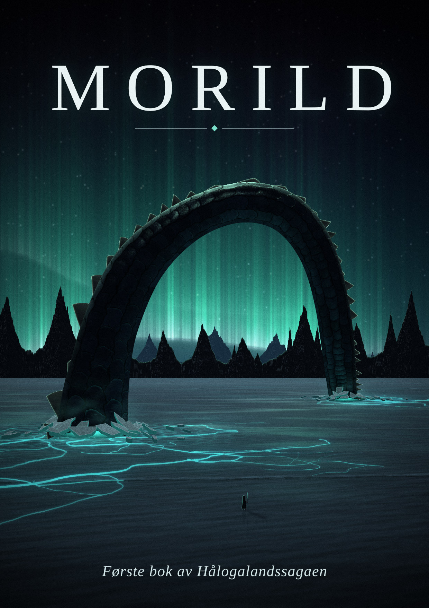
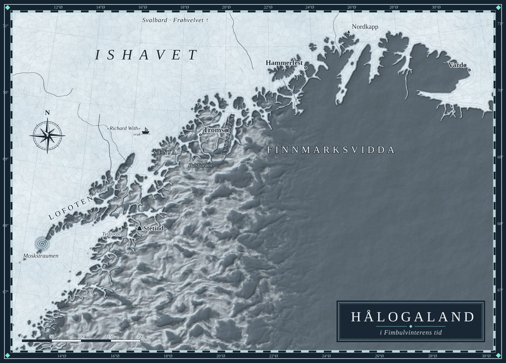

# Morild

*Første bok av Hålogalandssagaen* — en science fiction-roman på norsk,
skrevet i Word42.

Midgard, den første verden, som Riket nesten har glemt, har ligget under
Fimbulvinteren i tusener av år. Men i isen utenfor Hålogaland finnes
*morild*: det blågrønne, lysende stoffet som forlenger livet, skjerper
tanken og lar losene føre skipene gjennom mørket mellom stjernene. Hele
Keiserriket hviler på det, og bare Midgard har det.

Når hertug Leiv Ask får Hålogaland i len av keiseren, vet han at gaven er
en felle. Sønnen hans, femten år gamle Eirik, drømmer om en hule, en jente
med lysende øyne og en himmel av grønn ild. Han følger faren nordover inn i
mørketida — mot forræderiet, mot havbestene under isen, og mot Nattfolket,
som har ventet i generasjoner på en som skal komme med sola.

## Filene

| Fil | Hva det er |
| --- | --- |
| [Morild.odt](Morild.odt) | Manuskriptet: Word42-dokumentet, OpenDocument. Åpne det i Word42. |
| [Morild.pdf](Morild.pdf) | Boka satt i A5, 150 sider med omslag, kart og illustrasjoner, eksportert av Word42. |
| [Morild.epub](Morild.epub) | E-boka, eksportert av Word42 (File ▸ Export as E-book). |
| [bilder/](bilder/) | Omslaget, kartet over Hålogaland og de fire illustrasjonene. |

## Innhold

**Første del: Mørketid** — 1 Frostnåla · 2 Baronen · 3 Avskjed · 4 Tromsø ·
5 Morildfeltet · 6 Pust · 7 Forræderiet · 8 Ut i isen

**Andre del: Nattfolket** — 9 Døra · 10 Polarlågen · 11 Helleren ·
12 Holmgang · 13 Livsvatnet · 14 Fela

**Tredje del: Sola kommer tilbake** — 15 Draugrytteren · 16 Hoffet ·
17 Tre uker · 18 Gunnar · 19 Samlingen · 20 Stormslaget ·
21 Kvassere enn is · 22 Soldagen

Bakerst: en ordliste over Nattfolkets og Rikets ord.

## Slik ble boka laget

Boka er skrevet og satt i Word42, og hver av filene her er skrevet av
Word42 selv:

- Kapitlene er satt i stiler: *Normal* (brødtekst, blokkjustert med
  innrykk), *Første avsnitt* (uten innrykk etter overskrifter og
  sceneskift), *Heading 1* for de tre delene og *Heading 2* for
  kapitlene — begge med sideskift foran — og *Epigraf*, *Vers* og
  *Sceneskift*. Dokumentets språk er norsk bokmål (Tools ▸ Language ▸
  Default), så stavekontrollen, orddelingen og anførselstegnene « » følger
  norsk.
- Document Map viser ordtallet for hver del og hvert kapittel, og
  statuslinja teller ordene mot målet i Tools ▸ Word Count Goal.
- PDF-en og e-boka er laget fra manuskriptet med
  `word42 --convert-to=pdf Morild.odt` og `word42 --convert-to=epub Morild.odt`.

Omslaget, kartet og illustrasjonene er tegnet med kode. Kartet bygger på
kystlinjene fra [Natural Earth](https://www.naturalearthdata.com/).

Teksten og bildene deles på de samme vilkårene som Word42: GNU General
Public License, versjon 3 eller senere.
